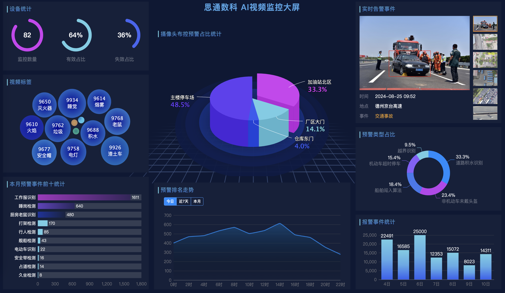
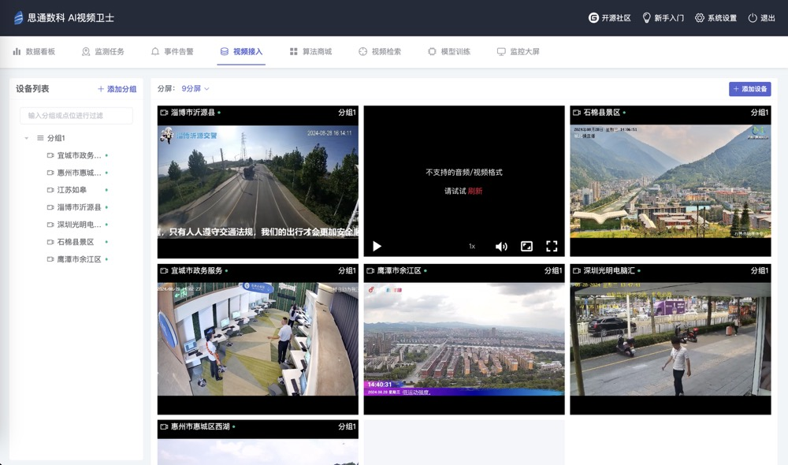
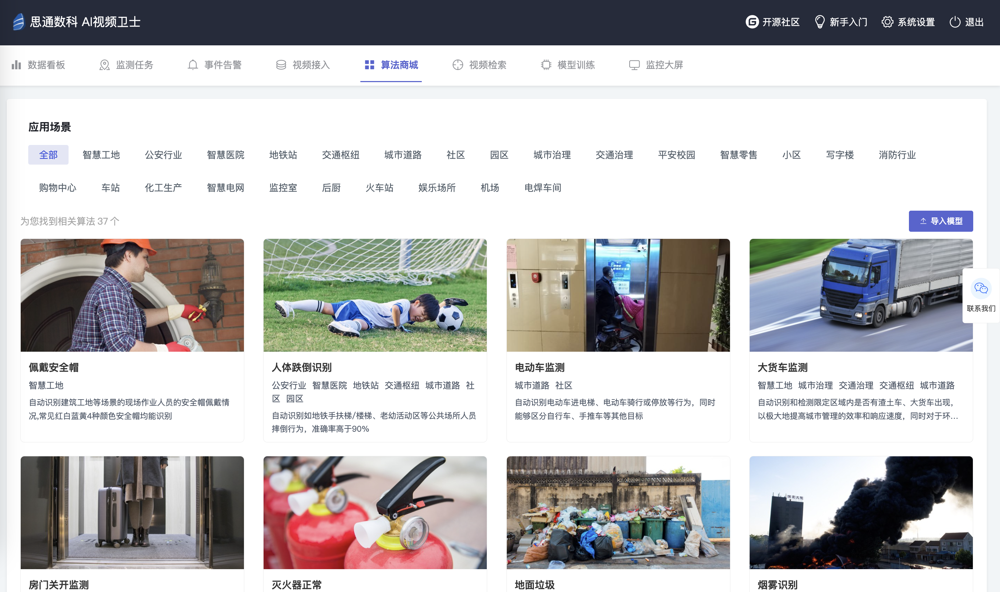
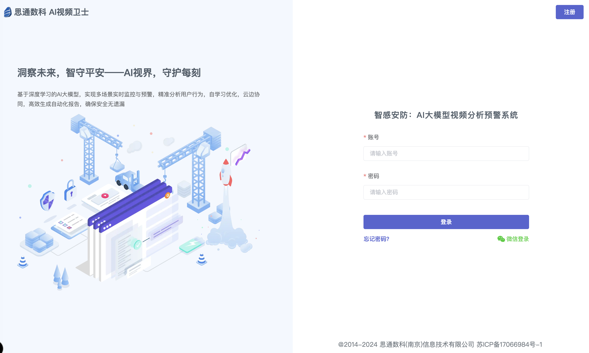

# 思通AI视频监控系统 - 完全免费&代码开源

 

## 专注视觉 AI 算法定制,1000+种 AI场景落地经验

## 我们最快8小时生产一个全新算法。

 

 

## 一、在线体验

 

微信扫码，免费体验：
[https://aiv.stonedt.com/vis/login](https://aiv.stonedt.com/vis/login)

 

 
 

## 二、项目概述

本产品是一个多功能AI实时监控系统，支持多种设备混合接入，包括：无人机、行车记录仪，收银机、监控摄像头、Pad、手机和电脑摄像头。系统具备高度灵活性，能够针对监控目标和范围提供实时预警。此外，系统内置低代码算法模型快速训练平台，简化了算法开发流程。用户还可以便捷地通过文字或图像搜索监控录像中的人脸、物体、标牌、车牌和语音对话。

   

## 三、技术栈介绍

  -  视频存储： Minio   
  -  消息中间件：RabbitMQ  
  -  数据库：  MySQL    
  -  视频搜索索引：  Elasticsearch    
  -  视频算法：  YoloV8
  -  预警消息推送： Websocket 
  -  视频流转码： ffmpeg 
  -  系统缓存： Redis

 

## 四、机器配置要求

- CPU intel i5 
- 内存 32G
- 磁盘 1T
- 显卡 6G
- 系统 Ubuntu 

 

## 五、已开源模型 (共20个免费模型)

| 模型名称     | 版本 |
| ------------ | ---- |
| 配戴安全帽   | v1.0 |
| 人体跌倒识别 | v1.0 |
| 电动车监测   | v1.0 |
| 大货车监测   | v1.0 |
| 房门关开监测 | v1.0 |
| 灭火器正常   | v1.0 |
| 地面积水     | v1.0 |
| 口罩识别     | v1.0 |
| 安全手套识别 | v1.0 |
| 玩手机识别   | v1.0 |
| 睡觉识别     | v1.0 |
| 吸烟监测     | v1.0 |
| 非机动车识别 | v1.0 |
| 表情识别     | v1.0 |
| 占道经营识别 | v1.0 |
| 智能电网守卫 | v1.0 |
| 宠物牵绳识别 | v1.0 |
| 轮椅识别     | v1.0 |
| 婴儿车识别   | v1.0 |
| 交通事故识别 | v1.0 |

 

## 六、产品功能

1. **实时监控功能**：
   - 视频直播画面：系统首页展示当前监控摄像头下的实时监测画面，用户可以点击全屏查看。
   - 监控画面切换：用户可以通过下拉框选择不同摄像头和分组，查看不同监控画面。
   - 实时数据展示：首页左侧栏展示最新的实时预警数据，用户可以点击查看详情。
   - 摄像头点位统计：管理员可以看到摄像头的生效、失效状态和总数。
   - 预警统计与走势：展示监控场景中预警次数最多的情况，以及不同时间范围内的预警类型统计。

2. **监测任务管理**：
   - 监测任务列表：展示用户创建的监控任务列表。
   - 添加监测任务：允许用户添加多个参数，并将任务分配给单个或多个摄像头。
   - 任务状态管理：用户可以对监控任务进行开启、停止或定时监控等操作。
   - 监测任务管理：用户可以查看任务详情并进行修改。

3. **事件告警功能**：
   - 事件列表：展示最新的报警信息，支持分类、分组和分时间段检索。
   - 告警详情：用户可以查看预警数据的详细信息。

4. **算法商城**：
   - 算法列表：实时同步更新算法列表。
   - 算法详情：查看算法的详细介绍。
   - 算法导入：通过本地或在线方式导入算法模型。
   - 停用与更新：允许用户停止当前算法并提醒相关监测任务，联网时自动检测更新。

5. **视频检索**：
   - 视频标记：自动为视频帧打标签。
   - 图像文字识别：自动提取视频中的文字内容。
   - 标记存储：存储视频标记和原始图片的对应关系。
   - 检索视频：通过关键词、摄像头点位、时间范围检索视频内容。

6. **模型训练（商用版）**：
   - 样本管理：上传图片样本作为训练数据集。
   - 样本标注：对图像进行目标物体标记。
   - 自动标注：使用导入的模型自动标注图像。
   - 模型发布：将训练好的模块发布到正式系统中。
   - 迭代训练：在原有模型基础上进行迭代训练。
   - 模型训练：使用标注后的数据样本进行模型训练。

7. **视频接入**：
   - 添加设备：添加不同协议型号的摄像头。
   - 分组管理：设置摄像头分组，便于管理。
   - 设备管理：对摄像头进行修改、删除等操作。

 

## 七、开源&商业版本对照表

| 序号 | 功能名称     | 功能描述                                                     | 开源版本 | 商业版本 |
| ---- | ------------ | ------------------------------------------------------------ | -------- | -------- |
| 1    | 视频直播画面 | 提供实时监控画面，支持全屏查看，以确保用户能够清晰地观察监控区域。 | 支持     | 支持     |
| 2    | 视频源接入   | 允许用户添加和管理不同协议型号的摄像头，以及进行分组管理，以便于统一监控和设备维护。 | 支持     | 支持     |
| 3    | 实时预警展示 | 在首页展示最新的实时预警数据，便于用户快速获取关键信息并进行进一步的查看。 | 支持     | 支持     |
| 4    | 预警统计分析 | 展示监控场景中的预警次数和类型统计，以及不同时间范围内的预警走势，帮助用户分析预警模式。 | 支持     | 支持     |
| 5    | 监测任务管理 | 提供监测任务的创建、状态管理和详情查看功能，使用户能够灵活地管理和调整监控任务。 | 支持     | 支持     |
| 6    | 事件告警     | 展示最新的报警信息，并支持详细信息查看，以便于用户及时响应和处理安全事件。 | 支持     | 支持     |
| 7    | 算法商城     | 提供算法的列表展示、详情查看、导入以及停用与更新功能，使用户能够根据需要选择合适的算法模型。 | 支持     | 支持     |
| 8    | 视频检索     | 通过自动标记、文字识别和关键词检索，使用户能够快速检索和定位视频内容。 | 支持     | 支持     |
| 9    | 模型训练     | 用户可以上传数据样本，系统提供样本管理、标注、自动标注、模型发布、迭代训练和训练功能，以支持用户进行模型的定制化训练。 | 不支持   | 支持     |
| 10   | 告警通知     | 系统支持通过邮件或即时通讯工具发送告警通知，确保用户能够及时接收到安全事件的提醒。 | 不支持   | 支持     |
| 11   | 目标计数     | 利用图像识别技术自动统计监控区域内的目标数量，为用户决策提供数据支持。 | 不支持   | 支持     |
| 12   | 人体姿态识别 | 系统能够识别和分析人体姿态，为安全监控和行为分析提供重要信息。 | 不支持   | 支持     |
| 13   | 框定区域预警 | 用户可以设定特定区域进行重点监控，一旦检测到异常行为即触发预警。 | 不支持   | 支持     |
| 14   | 设定置信度   | 允许用户根据需要设定预警的置信度阈值，以过滤误报并提高预警的准确性。 | 不支持   | 支持     |
| 15   | 多用户管理   | 系统支持多用户账户设置，允许不同权限级别的用户访问和操作，以实现有效的团队协作和权限控制。 | 不支持   | 支持     |
| 16   | API接口调用  | 支持第三方系统通过API调用算法模型进行预测，并且提供文档和技术支持 | 不支持   | 支持     |

 

## 八、安装教程

 

[安装文档](https://docs.qq.com/doc/DZEtmS01tT3d4Y21p)

 

## 九、快速入门

 

[新手入门](https://docs.qq.com/doc/DQXZXcFFFU3lrcENY)

 

## 十、接口文档

 

[思通AI视频监控系统-影像监测调用接口文档](https://docs.qq.com/pdf/DZFV2dm9jTUd2bGJ5?)

 

 

[思通AI视频监控系统-影像模型训练接口文档](https://docs.qq.com/pdf/DZGpmcm9kYlNZQUVx?)

 

## 十一、联系我们

扫描微信二维码，商务合作。

## 捐赠方式

## License & Copyright

Copyright (c) 2014-2023 思通数科 StoneDT, All rights reserved.

Licensed under The GNU General Public License version 3 (GPLv3)  (the "License"); you may not use this file except in compliance with the License. You may obtain a copy of the License at

<https://www.gnu.org/licenses/gpl-3.0.html>

Unless required by applicable law or agreed to in writing, software distributed under the License is distributed on an "AS IS" BASIS, WITHOUT WARRANTIES OR CONDITIONS OF ANY KIND, either express or implied. See the License for the specific language governing permissions and limitations under the License.
